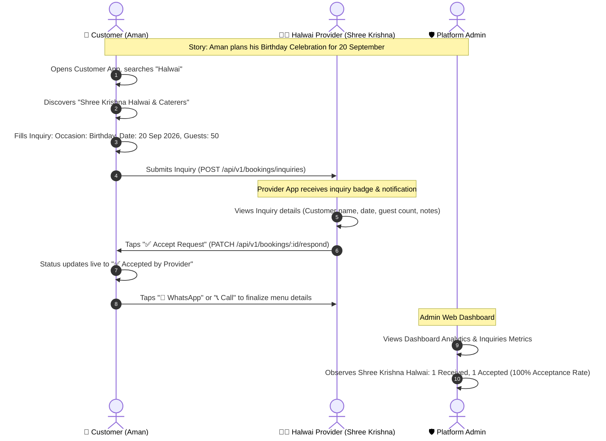
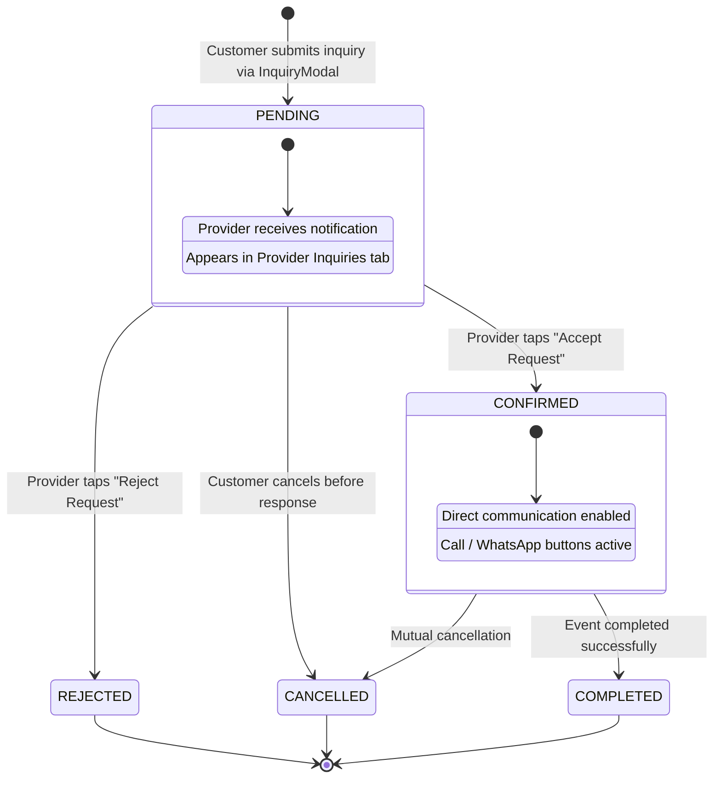

# Shubh Ausar (शुभ अवसर): Architecture, Workflow & Technical Guide

> **"शुभ अवसर — Celebrate Every Occasion"** — A full-stack, multi-application marketplace for discovering, booking, and managing local event services, cultural ceremonies, and family celebrations.

---

## 📖 Table of Contents

1. [Executive Summary & Vision](#1-executive-summary--vision)
2. [Real-World Story & Workflow](#2-real-world-story--workflow)
3. [System Architecture](#3-system-architecture)
4. [Applications & Personas](#4-applications--personas)
   - [Customer Mobile App (`customer-app`)](#41-customer-mobile-app)
   - [Provider Mobile App (`provider-app`)](#42-provider-mobile-app)
   - [Admin Web Dashboard (`admin-web`)](#43-admin-web-dashboard)
   - [Backend API Engine (`backend`)](#44-backend-api-engine)
5. [Inquiry & Booking Lifecycle (State Machine)](#5-inquiry--booking-lifecycle-state-machine)
6. [Core Categories & Services Matrix](#6-core-categories--services-matrix)
7. [Database Schema & Domain Architecture](#7-database-schema--domain-architecture)
8. [Security & Authentication Architecture](#8-security--authentication-architecture)
9. [API Reference & Route Catalog](#9-api-reference--route-catalog)
10. [Local Development & Quick Start](#10-local-development--quick-start)
11. [Default Seeded Test Accounts](#11-default-seeded-test-accounts)
12. [Troubleshooting & FAQ](#12-troubleshooting--faq)

---

## 1. Executive Summary & Vision

Planning an Indian celebration—whether a birthday party, wedding, mundan, griha pravesh, or festive pooja—is traditionally stressful and fragmented. Families spend days calling local halwais, tent houses, sound vendors, decorators, and makeup artists with zero pricing transparency and uncertain availability.

**Shubh Ausar (शुभ अवसर)** unifies this entire ecosystem into one coordinated digital platform:
- **Customers** easily discover verified local service providers, check services and pricing, and submit precise event inquiries with occasion details, dates, guest counts, and special notes.
- **Service Providers (Vendors)** receive real-time inquiry cards, review occasion specifications, and accept or reject requests with one tap, plus call or WhatsApp customers directly.
- **Platform Administrators** maintain catalog taxonomy, verify KYC credentials, monitor booking fulfillment rates, and review provider acceptance performance.

---

## 2. Real-World Story & Workflow

Here is how the entire system operates end-to-end using a real-world scenario:



### The 4 Phases:

1. **Discovery & Custom Inquiry (Customer App)**:
   - Aman needs a Halwai for his birthday on 20 September.
   - He opens the Customer App, navigates to the **Halwai & Catering** category, and reviews nearby caterers with ratings and specialties.
   - He clicks **"Send Inquiry"**, selects **Occasion: Birthday**, sets **Date: 20 Sep 2026**, **Guest Count: 50**, **Location: Model Town**, and notes: *"Need pure desi ghee sweets & morning poori sabzi breakfast"*.
   - He also submits a separate inquiry for a **Mehndi Artist** for family guests on the same date.

2. **Inquiry Inbox & Response (Provider App)**:
   - The provider logs in as `halwai@gmail.com`.
   - The notification badge and **Inquiries tab** show the incoming request.
   - The card shows all details: Aman's name, phone number, occasion, date, and food preferences.
   - The provider can tap **"✅ Accept Request"** or **"❌ Reject Request"** with a reason.
   - Acceptance triggers an instant confirmation state on the backend.

3. **Live Confirmation & Communication (Customer App)**:
   - Aman opens **My Inquiries** tab.
   - The status badge has turned to **`✅ ACCEPTED`**.
   - One-tap buttons allow Aman to **Call** or open **WhatsApp** directly with the Halwai.

4. **Marketplace Governance & Performance (Admin Web)**:
   - Admin logs into `http://localhost:3000/`.
   - The **Celebration Inquiries & Performance** section displays:
     - Total Inquiries: `1`
     - Accepted: `1` (100% acceptance rate)
     - Provider breakdown showing *Shree Krishna Halwai & Caterers* with response analytics.

---

## 3. System Architecture

The project is architected as a clean multi-application monorepo sharing a centralized Node.js/Express REST API and PostgreSQL database:

```text
                               ┌─────────────────────────────────────────┐
                               │             PostgreSQL 15+              │
                               │        (Prisma ORM Persistence)         │
                               └────────────────────▲────────────────────┘
                                                    │
                               ┌────────────────────┴────────────────────┐
                               │           Backend API Engine            │
                               │   (Express, TypeScript, JWT, BullMQ)    │
                               └──────▲──────────────────▲────────▲──────┘
                                      │                  │        │
               ┌──────────────────────┴──────┐           │        └──────────────────────┐
               │                             │           │                               │
┌──────────────┴──────────────┐ ┌────────────┴───────────┴─┐ ┌───────────────────────────┴───┐
│     Customer Mobile App     │ │    Provider Mobile App    │ │       Admin Web Portal        │
│   (React Native + Expo)     │ │   (React Native + Expo)   │ │  (React 18 + Vite + Tailwind) │
│ - Category/Service Search   │ │ - Inquiries Feed & Status │ │ - Platform Governance         │
│ - Instant Event Inquiries   │ │ - Accept / Reject Action  │ │ - Provider Acceptance Metrics │
│ - Inquiries Tracker         │ │ - Service Catalog Editor  │ │ - KYC & Vendor Approval       │
│ - Top/Bottom Toolbar & Menu │ │ - Top/Bottom Toolbar & Menu │ - Auto-refresh Session Admin │
└─────────────────────────────┘ └───────────────────────────┘ └───────────────────────────────┘
```

---

## 4. Applications & Personas

### 4.1. Customer Mobile App (`customer-app`)
- **Technology**: React Native, Expo, React Navigation 6, TanStack React Query, Redux Toolkit, React Native Vector Icons.
- **Key Modules & UI Components**:
  - `CustomerTopBar`: Auspicious header displaying greeting, user profile avatar, unread notification counter, and quick drawer toggle.
  - `CustomerBottomBar`: Persistent bottom navigation bar for **Home**, **Inquiries**, **Events**, **Notifications**, and **Profile**.
  - `CustomerSideMenu`: Slide-out navigation drawer with user details and quick links.
  - `InquiryModal`: Bottom sheet modal with occasion picker, calendar date selector, guest count slider, address input, and notes.
  - `CustomerInquiriesScreen`: Live inquiry list with status badges (`PENDING`, `ACCEPTED`, `DECLINED`), occasion badges, and direct WhatsApp/Call triggers.
  - `HomeScreen`: Interactive banners, 8 core categories grid, featured local vendors, and venue location selector.

### 4.2. Provider Mobile App (`provider-app`)
- **Technology**: React Native, Expo, React Navigation 6, Axios API client with token refresh.
- **Key Modules & UI Components**:
  - `ProviderTopBar`: Provider identity toolbar showing business name, verification badge, notifications counter, and drawer trigger.
  - `ProviderBottomBar`: Bottom navigation with **Dashboard**, **Inquiries**, **Catalog**, and **Earnings**.
  - `ProviderInquiriesView`: Incoming customer inquiries list with occasion pill, date, guest count, and **✅ Accept** / **❌ Reject** action buttons.
  - `CatalogDashboardScreen`: Add and edit service packages, pricing, images, and description.
  - `ProviderHomeScreen`: Daily booking metrics, revenue chart, and status toggle (Online/Offline).

### 4.3. Admin Web Dashboard (`admin-web`)
- **Technology**: React 18, Vite, TypeScript, Tailwind CSS, Lucide React, TanStack Query.
- **Key Features**:
  - **Persistent Session Architecture**: Centralized `apiClient.ts` with silent JWT auto-refresh interceptor; handles 401s transparently without sudden logouts.
  - **Dashboard Analytics**: Total platform inquiries, acceptance rate %, provider-by-provider inquiry performance table.
  - **Vendor KYC & Governance**: Approve, suspend, or reject vendor profiles and review uploaded identity documents.
  - **Category Management**: Create, edit, and organize categories and subcategories with icon and sort order configuration.
  - **User Management**: View and govern customers, providers, and admins with status filters.

### 4.4. Backend API Engine (`backend`)
- **Technology**: Node.js, Express, TypeScript, Prisma ORM, PostgreSQL, Redis, BullMQ, Zod validation, Bcrypt, JsonWebToken.
- **Key Architecture**:
  - Layered Architecture: `Controller -> Service -> Repository -> Database`.
  - Token Rotation: Secure 1-day access tokens backed by 7-day rotated refresh tokens with database session tracking and replay attack detection.
  - Rate Limiting: Configurable window-based rate limiting on sensitive auth endpoints.

---

## 5. Inquiry & Booking Lifecycle (State Machine)

Every customer celebration request transitions through a strict, predictable lifecycle:



---

## 6. Core Categories & Services Matrix

The marketplace is organized into **8 high-demand celebration categories**:

| # | Category Name | Slug | Sample Sub-Services & Offerings |
|---|---------------|------|----------------------------------|
| 1 | **Halwai & Catering** | `halwai-catering` | Desi Ghee Sweets, Wedding Buffet, Live Chaat Counter, Breakfast Poori Sabzi |
| 2 | **Decoration** | `decoration` | Balloon Theme Decor, Flower Backdrop, Mandap Setup, Haldi & Mehndi Decor |
| 3 | **Beautician & Makeup** | `beautician-makeup` | Bridal HD Makeup, Party & Birthday Makeup, Hair Styling & Saree Draping |
| 4 | **Mehndi Artist** | `mehndi-artist` | Bridal Mehndi, Arabic & Contemporary Henna, Guest Mehndi Packages |
| 5 | **Photography & Videography** | `photography-videography` | Birthday Party Shoot, Candid Wedding Photography, 4K Drone Coverage |
| 6 | **DJ, Sound & Music** | `dj-sound-music` | Birthday DJ & Laser Lights, Dhol & Tasha Troupes, PA Sound System |
| 7 | **Pandit Ji & Rituals** | `pandit-ji-rituals` | Birthday Havan & Puja, Vivah Sanskar, Griha Pravesh, Satyanarayan Katha |
| 8 | **Tent & Furniture Setup** | `tent-furniture` | Shamiyana Pandals, VIP Sofas & Banquet Chairs, Fairy Lights & Air Coolers |

---

## 7. Database Schema & Domain Architecture

Key models managed in `backend/prisma/schema.prisma`:

- **`User`**: Base identity for `CUSTOMER`, `VENDOR`, and `ADMIN`. Contains phone, email, password hash, status, and sessions.
- **`VendorProfile`**: Vendor business identity, business name, verification status (`isVerified`), address, city, rating average, and KYC documents.
- **`Category`**: Hierarchical category tree with parent-child relationship, slug, icon, and sort order.
- **`Service`**: Individual service listing created by vendors under specific categories with pricing models (`FIXED`, `HOURLY`, `STARTING_AT`, `CUSTOM_QUOTE`).
- **`Booking`**: Central booking and inquiry entity linking `customerId`, `vendorId`, `serviceDate`, `totalPrice`, status (`PENDING`, `CONFIRMED`, `REJECTED`, `CANCELLED`, `COMPLETED`), and custom inquiry notes.
- **`BookingItem`**: Granular items or packages associated with a specific booking.
- **`Session`**: Refresh token session record storing hashed tokens, expiry timestamps, device metadata, and revocation flags.
- **`Notification`**: System notifications for real-time status alerts.

---

## 8. Security & Authentication Architecture

### JWT Dual-Token Rotation
1. **Access Token**: Short-lived JWT (1 day) containing `userId`, `role`, and `sessionId`.
2. **Refresh Token**: High-entropy 48-byte token (7 days) stored as a cryptographic hash in PostgreSQL.
3. **Silent Refresh Interceptor**:
   - Both Web and Mobile clients intercept `401 Unauthorized` responses.
   - Client queues pending requests and hits `POST /api/v1/auth/refresh`.
   - The backend validates the session, issues a new access token, rotates the refresh token, and replays the original requests seamlessly.
   - Replay Attack Detection: If a previously revoked refresh token is used, all active sessions for that user are immediately terminated.

---

## 9. API Reference & Route Catalog

### 🔐 Authentication (`/api/v1/auth`)
| Method | Endpoint | Description | Auth Required |
|--------|----------|-------------|---------------|
| `POST` | `/auth/customer/login` | Phone & password login for customers | No |
| `POST` | `/auth/customer/register` | Customer sign-up | No |
| `POST` | `/auth/provider/login` | Vendor login | No |
| `POST` | `/auth/admin/login` | Administrator login | No |
| `POST` | `/auth/refresh` | Rotate access & refresh tokens | No (Body token) |
| `GET`  | `/auth/me` | Retrieve authenticated profile | Yes |
| `POST` | `/auth/logout` | Revoke session & refresh token | No (Body token) |

### 📅 Bookings & Inquiries (`/api/v1/bookings`)
| Method | Endpoint | Description | Auth Required |
|--------|----------|-------------|---------------|
| `POST` | `/bookings/inquiries` | Customer submits an event inquiry | Customer |
| `GET`  | `/bookings/customer` | List inquiries submitted by current customer | Customer |
| `GET`  | `/bookings/vendor` | List incoming inquiries for vendor | Vendor |
| `PATCH`| `/bookings/:id/respond` | Provider accepts or rejects inquiry | Vendor |
| `PATCH`| `/bookings/:id/cancel` | Customer cancels pending inquiry | Customer |

### 🛍️ Marketplace & Vendors (`/api/v1/marketplace`)
| Method | Endpoint | Description | Auth Required |
|--------|----------|-------------|---------------|
| `GET`  | `/marketplace/categories` | List active categories & subcategories | No |
| `GET`  | `/marketplace/vendors` | Search & filter vendors (city, category, verified) | No |
| `GET`  | `/marketplace/vendors/:id` | Get vendor public profile & catalog | No |

### 🛡️ Admin Governance (`/api/v1/admin`)
| Method | Endpoint | Description | Auth Required |
|--------|----------|-------------|---------------|
| `GET`  | `/admin/analytics/inquiries` | Inquiries overview & provider acceptance rates | Admin |
| `GET`  | `/admin/vendors` | List vendors with KYC status | Admin |
| `PATCH`| `/admin/vendors/:id/verify` | Approve or reject vendor KYC | Admin |
| `GET`  | `/admin/users` | List platform users with role filters | Admin |

---

## 10. Local Development & Quick Start

### Prerequisites
- **Node.js**: v18.0 or higher
- **PostgreSQL**: v14 or higher (Running locally or via Docker)
- **Expo CLI**: Installed globally (`npm install -g expo-cli`) or via `npx expo`

### 1. Backend Setup
```bash
cd backend
npm install
cp .env.example .env
# Configure DATABASE_URL in .env, then generate schema & seed:
npx prisma generate
npx prisma db push
npm run seed
npm run dev
# Server running at: http://localhost:8000 (Health check: http://localhost:8000/api/v1/health)
```

### 2. Admin Web Portal
```bash
cd admin-web
npm install
npm run dev
# Portal running at: http://localhost:3000
```

### 3. Customer Mobile App
```bash
cd customer-app
npm install
npx expo start
# Press 'a' to open on Android Emulator or scan QR with Expo Go
```

### 4. Provider Mobile App
```bash
cd provider-app
npm install
npx expo start
# Runs Metro bundler on port 8082
```

---

## 11. Default Seeded Test Accounts

All seeded accounts use password: **`Password@123`**

| Role / Persona | Email | Name / Business Name | Primary Features to Test |
|----------------|-------|----------------------|---------------------------|
| **Platform Admin** | `admin@gmail.com` | Super Admin | Dashboard Analytics, Provider Performance Table, KYC Verification |
| **Customer** | `customer@gmail.com` | Dhiraj Customer | Search Halwai/Mehndi, Send Inquiry (20 Sep Birthday), Track status |
| **Halwai Provider** | `halwai@gmail.com` | Shree Krishna Halwai & Caterers | Accept/Reject birthday inquiry, direct WhatsApp contact |
| **Beautician Provider** | `beautician@gmail.com` | Pooja Makeover & Mehndi Art | Review makeup/mehndi inquiries, manage services |
| **Decorator Provider** | `provider@gmail.com` | Royal Celebrations & Decor | Review balloon/stage decor inquiries, update catalog |

---

## 12. Troubleshooting & FAQ

### Q: Why did Admin Web logout suddenly?
> **Resolved**: We implemented a centralized `apiClient.ts` with persistent `localStorage` and a silent auto-refresh interceptor. Tokens are renewed automatically before expiry.

### Q: How do mobile apps communicate with localhost on real devices?
> Set `API_URL` in `customer-app/src/config/index.ts` and `provider-app/src/config/index.ts` to your machine's LAN IP (e.g. `http://192.168.1.100:8000/api/v1` or `http://10.44.62.6:8000/api/v1`).

---

*Authored with dedication for Shubh Ausar (शुभ अवसर) — Transforming celebration planning across India.*
