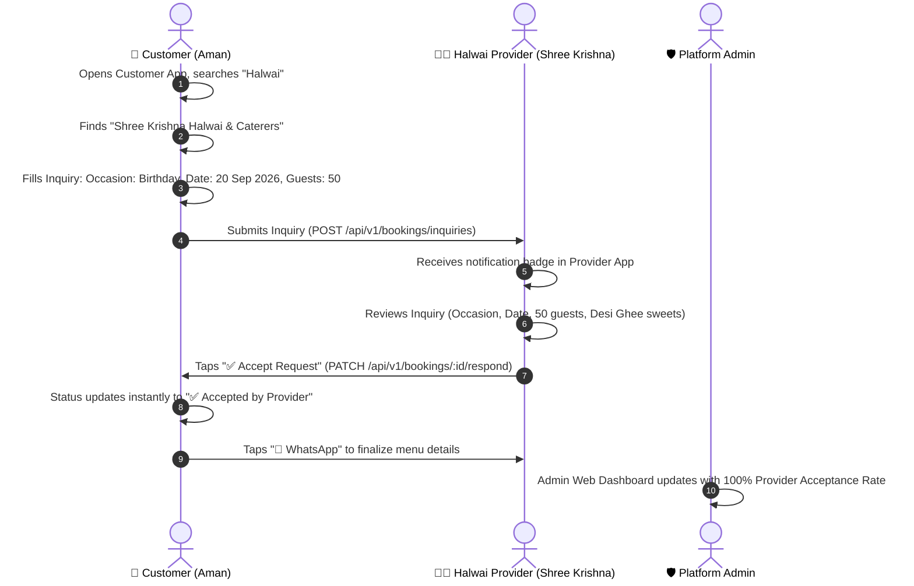

# 🪔 Shubh Mangalam (शुभ मंगलम)

> ### *"Har Celebration, Ek Platform"*
> A full-stack, multi-application marketplace for discovering, booking, and managing local event services, cultural ceremonies, and family celebrations across India.

---

## 🌟 Overview

**Shubh Mangalam** eliminates the chaos of planning Indian celebrations. Whether organizing a **Birthday Party on 20 September**, a grand **Wedding & Reception**, a **Mundan ceremony**, or festive **Pooja rituals**, Shubh Mangalam connects event hosts with verified local service providers (Halwais, Decorators, Mehndi Artists, Makeup Artists, DJs, Pandits, Tent Houses) through a transparent, inquiry-first workflow.

---

## 🏗️ Architecture & Applications

The repository is organized as a unified multi-application ecosystem sharing a central backend and PostgreSQL database:

```text
                               ┌─────────────────────────────────────────┐
                               │           PostgreSQL Database           │
                               │        (Prisma ORM Persistence)         │
                               └────────────────────▲────────────────────┘
                                                    │
                               ┌────────────────────┴────────────────────┐
                               │           Backend API Engine            │
                               │   (Node.js, Express, TypeScript, JWT)   │
                               └──────▲──────────────────▲────────▲──────┘
                                      │                  │        │
               ┌──────────────────────┴──────┐           │        └──────────────────────┐
               │                             │           │                               │
┌──────────────┴──────────────┐ ┌────────────┴───────────┴─┐ ┌───────────────────────────┴───┐
│     Customer Mobile App     │ │    Provider Mobile App    │ │       Admin Web Portal        │
│   (React Native + Expo)     │ │   (React Native + Expo)   │ │  (React 18 + Vite + Tailwind) │
│                             │ │                           │ │                               │
│ • Category & Vendor Search  │ │ • Live Inquiries Feed     │ │ • Platform Analytics          │
│ • Custom Event Inquiries    │ │ • 1-Tap Accept / Reject   │ │ • Provider Acceptance Metrics │
│ • Live Status Tracking      │ │ • Direct WhatsApp / Call  │ │ • KYC & Vendor Verification   │
│ • Auspicious Top/Bottom Bar │ │ • Service Catalog Editor  │ │ • Silent Auto-Refresh Auth    │
└─────────────────────────────┘ └───────────────────────────┘ └───────────────────────────────┘
```

| Application | Directory | Tech Stack | Purpose |
|-------------|-----------|------------|---------|
| **Customer App** | [`customer-app/`](./customer-app/) | React Native, Expo, Redux Toolkit, React Query | Mobile app for event hosts to discover vendors, send inquiries, and track bookings. |
| **Provider App** | [`provider-app/`](./provider-app/) | React Native, Expo, React Navigation, Axios | Mobile app for local vendors to review incoming inquiries, accept/reject requests, and manage services. |
| **Admin Web** | [`admin-web/`](./admin-web/) | React 18, Vite, TypeScript, Tailwind CSS | Governance dashboard to monitor inquiries, track provider response rates, and verify vendor KYC. |
| **Backend API** | [`backend/`](./backend/) | Express, TypeScript, Prisma ORM, PostgreSQL, Redis | REST API engine powering authentication, inquiries, catalog, notifications, and analytics. |

---

## 🎂 Real-World User Workflow (The Birthday Story)



---

## 🎪 Core Categories & Services

The marketplace focuses on **8 core celebration services**:

1. 🍲 **Halwai & Catering** — Traditional Desi Ghee sweets, Wedding Buffets, Live Chaat counters, Morning Poori Sabzi.
2. 🎈 **Decoration** — Balloon Birthday themes, Stage & Flower Backdrops, Mandap & Varmala setups, Haldi/Mehndi decor.
3. 💄 **Beautician & Makeup** — Party & Birthday Makeup, HD Bridal Makeover, Hair Styling & Saree Draping.
4. 🌿 **Mehndi Artist** — Bridal Henna, Arabic & Modern designs, Family & Guest Mehndi packages.
5. 📸 **Photography & Videography** — Birthday Shoots, Candid Wedding Photography, 4K Cinematic & Drone Coverage.
6. 🎵 **DJ, Sound & Music** — Party DJ with Laser Lights, Traditional Dhol & Tasha troupes, PA Sound Systems.
7. 🪔 **Pandit Ji & Rituals** — Birthday Havan & Puja, Vivah Sanskar, Griha Pravesh, Satyanarayan Katha.
8. ⛺ **Tent & Furniture Setup** — Shamiyana Pandals, Banquet Chairs & VIP Sofas, Fairy Lights & Air Coolers.

---

## 🔑 Default Seeded Test Accounts

Run `npm run seed` in `backend/` to populate these ready-to-test accounts.
**Password for all accounts:** `Password@123`

| Role | Email | Name / Business Name | Description |
|------|-------|----------------------|-------------|
| **Platform Admin** | `admin@gmail.com` | Super Admin | Access Admin Web at `http://localhost:3000` |
| **Customer** | `customer@gmail.com` | Dhiraj Customer | Customer app login; can submit inquiries |
| **Halwai Provider** | `halwai@gmail.com` | Shree Krishna Halwai & Caterers | Receives birthday catering inquiries |
| **Beautician Provider** | `beautician@gmail.com` | Pooja Makeover & Mehndi Art | Receives makeup & henna inquiries |
| **Decorator Provider** | `provider@gmail.com` | Royal Celebrations & Decor | Receives theme decor & tent inquiries |

---

## 🚀 Quick Start Guide

### 1. Prerequisites
- **Node.js**: v18+
- **PostgreSQL**: v14+ running locally or via Docker
- **npm** or **yarn**

### 2. Backend Setup
```bash
cd backend
npm install
cp .env.example .env
# Set DATABASE_URL in .env
npx prisma generate
npx prisma db push
npm run seed
npm run dev
# Server running at: http://localhost:8000
```

### 3. Admin Web Portal
```bash
cd admin-web
npm install
npm run dev
# Open in browser: http://localhost:3000
# Login: admin@gmail.com / Password@123
```

### 4. Customer Mobile App
```bash
cd customer-app
npm install
npx expo start
# Press 'a' for Android emulator or scan QR with Expo Go
```

### 5. Provider Mobile App
```bash
cd provider-app
npm install
npx expo start
# Runs Metro bundler on port 8082
```

---

## 📚 Complete Technical Documentation

For the comprehensive deep dive into:
- System Flowcharts & State Machines
- End-to-End Inquiry Lifecycle
- Prisma Data Models & Entity Relationships
- JWT Dual-Token Rotation & Silent Auto-Refresh Architecture
- Complete REST API Route Reference

👉 **Read the full documentation: [PROJECT_WORKFLOW_AND_ARCHITECTURE.md](./PROJECT_WORKFLOW_AND_ARCHITECTURE.md)**

---

## 📄 License
This project is proprietary and maintained for the Shubh Mangalam platform.
